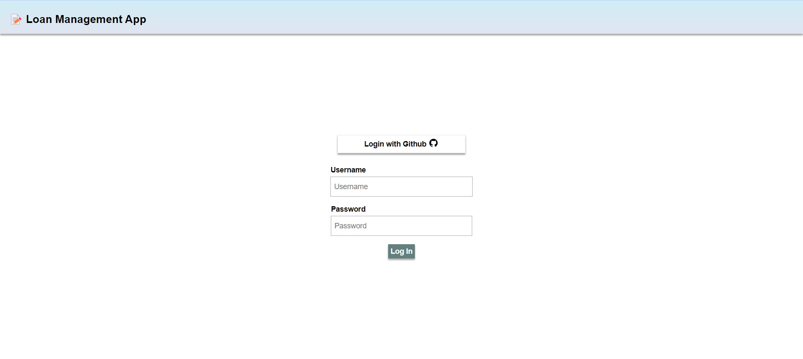
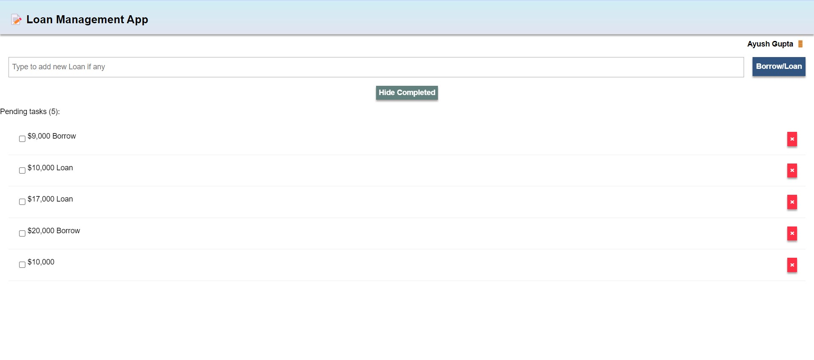

# Loan Management App

## Description

The Loan Management App allows users to register using their email and choose roles such as admin, borrower, or lender. Borrowers can request loans, view past loans, and lenders can confirm payments and track past transactions. The app ensures that the change of status is reflected on each user's dashboard, with admin users having access to complete transaction details.

## Table of Contents

- [Loan Management App](#loan-management-app)
  - [Description](#description)
  - [Table of Contents](#table-of-contents)
  - [Installation](#installation)
  - [Usage](#usage)
  - [Technologies Used](#technologies-used)
  - [Screenshots](#screenshots)

## Installation

1. Clone the repository:
   ```bash
   git clone https://github.com/your-username/loan-management-app.git
   meteor npm install -g meteor
   cd loan-management-app
   meteor npm install

## Usage

2. To run the application locally, use the following command:
   ```bash
   meteor

## Technologies Used
3. The Loan Management App is built using the following technologies:

      Meteor.js <br>
      HTML<br>
      CSS <br>
      React

## Screenshots
1. Login Page
   
      


2. DashBoard
   
      
